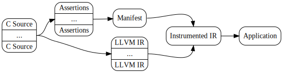

This page walks you through how to use TESLA. It explains how TESLA is
implemented (and some associated terminology), how to use the toolchain, then
how to start writing useful assertions about your programs.

# TESLA Basics

TESLA is implemented as a set of tools that extend the traditional C compilation
process. To write TESLA assertions, you need to add these tools to your
build system and generate the TESLA intermediate products.

## Intermediate Products

To use TESLA, you need to generate some extra intermediate products during your
build process. These products are:

* **Assertions**: the assertions you write about a program are parsed out and
  written to external files in a structured format.
* **Manifest**: assertions in one file can reference those written in other
  files, so they need to be merged into one manifest file.
* **LLVM IR**: your code needs to be compiled to LLVM IR so that the TESLA tools
  can analyse and modify it.
* **Instrumented IR**: the assertion manifest is used to add TESLA
  instrumentation code to the compiled LLVM IR.

A dependency graph between these products is shown in the graph below.

{: .center-image }

## Toolchain

To generate TESLA intermediate products, you use the TESLA command-line tools.
These are:

* `tesla analyse` generates an assertion file (`.tesla`) from a C source file.
* `tesla cat` combines assertion files together into a manifest.
* `tesla instrument` uses a manifest to add instrumentation code to IR.

Your C programs need to be compiled using `clang` 4.0. To generate LLVM IR from
a C source, use the flags `-c -emit-llvm`.

# Example

It's useful to work through a simple example to get a feel for the TESLA
toolchain and assertion language. The scenario we'll consider here is a [mutual
exclusion lock][mutex], with the aim of preventing deadlock.

## Setup

The first step is to establish the data structures and operations we'll be
working with. At its simplest, a mutual exclusion lock can be modelled by a
structure with a single boolean field:

```c
#include <stdatomic.h>
#include <stdbool.h>

struct lock {
  _Atomic(bool) held;
};
```

If we have a lock, the only things we can do are to _acquire_ or _release_ it:

```c
bool lock_acquire(struct lock *l) {
  bool f = false;
  return atomic_compare_exchange_strong(&(lock->held), &f, true);
}

void lock_release(struct lock *l) {
  l->held = false;
}
```

These operations are thread safe (because they're written using the C11 atomics
library). If `lock_acquire` is called on a lock that's already held, it returns
`false`. If we acquired the lock successfully, then it returns `true`.

## A First Assertion

To prevent deadlock in code that uses these locks, the property we'd like to
assert is that a lock must eventually be released after it is acquired. The
TESLA expression of this property is:

```c
#include <tesla-macros.h>

bool lock_acquire(struct lock *l) {
  TESLA_WITHIN(main, eventually(
    call(lock_release(l))
  ));

  bool f = false;
  return atomic_compare_exchange_strong(&(lock->held), &f, true);
}
```

[mutex]: https://en.wikipedia.org/wiki/Mutual_exclusion
